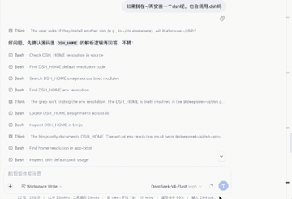

# dsh-qnav

<div align="center">

[English](README.md) · [中文](README.zh-CN.md) · [日本語](README.ja-JP.md) · [Español](README.es.md) · **Français**

</div>

---

### En une phrase

Un rail de navigation par question sur le bord droit pour les longues conversations DSH — chaque vraie question utilisateur reçoit une pastille survolable ; cliquez pour sauter directement au tour concerné, la position actuelle reste mise en évidence pendant le défilement.

### Installation (trois étapes)

```bash
# 1. Cloner depuis GitHub
git clone https://github.com/lin-nanxing/dsh-qnav.git
cd dsh-qnav

# 2. Construire (uniquement si vous modifiez le code source)
npm run build

# 3. Une seule commande pour monter dans DSH
dsh plugin --profile web add link:.
```

> 💡 **Pas besoin de publier sur npm !**
> Le préfixe `link:` indique à DSH d'installer depuis un chemin local. Après avoir cloné, **exécutez simplement l'étape 3 dans le répertoire du projet**.
>
> « Publier sur npm » signifie uploader votre paquet sur le registre public npm pour que d'autres puissent simplement taper `dsh plugin --profile web add dsh-qnav`. **C'est optionnel** — cela n'affecte pas votre propre utilisation.

### Fonctionnalités clés

1. **Extraction précise** — Lit les vraies questions utilisateur depuis les nœuds DOM de conversation DSH via `data-chat-flow-kind="user"`, filtre les lignes steering/pending/contexte ; inclut un secours avec `[class*="userRow"]`.
2. **Saut par référence d'élément** — Sauvegarde la référence DOM de chaque `flowItem` au lieu de faire une correspondance par préfixe de texte ; les clics appellent directement `scrollIntoView()`. Élimine les bugs de déduplication, collisions de préfixes et divisions de nœuds de texte par références @.
3. **Filtrage automatique des lignes invalides** — Exclut les entrées non validées et les injections système via `data-pending-steering` et `data-chat-flow-kind`. Pas de pastilles trompeuses vides.
4. **Disposition proportionnelle** — Les pastilles sont réparties uniformément le long du bord droit, s'adaptant selon le nombre de questions.
5. **Support du mode sombre** — CSS `color-scheme: light dark` + `@media (prefers-color-scheme: dark)` change automatiquement la couleur de mise en évidence selon le thème de la page.
6. **Infobulle de survol** — Au survol, affiche « N. <question complète> » à gauche ; les infobulles s'ancrent à gauche pour éviter le débordement et mesurent leurs dimensions avant positionnement (sans scintillement).
7. **Mise en évidence de la position courante** — Mise à jour en temps réel via les rectangles d'éléments (`getBoundingClientRect().top ≤ 120px`) au lieu de traversées fragiles de l'arbre de texte, insensible aux citations dans les réponses.
8. **Synchronisation MutationObserver** — Rescan et rerendu des pastilles après modification du contenu (debounce 500ms) ; la mise en évidence est actualisée toutes les 600 ms.
9. **Sécurité HMR** — `apply(ctx)` renvoie un dispositif qui nettoie les observateurs, intervalles, le DOM injecté et les feuilles de style — pas de fuites lors du rechargement ou de la désactivation.

### Améliorations par rapport au preload bureau

| Dimension | Preload bureau `preload-nav.js` | Plugin `dsh-question-nav` |
|---|---|---|
| Environnement | Preload du shell Electron (bureau uniquement) | Client web DSH (toute plateforme) |
| Installation | Nécessite édition de `lib/tabs.js` + recompilation | Une seule commande `dsh plugin add link:.` |
| Sandbox | Besoin de `sandbox: false` | Pur client, sans changement de sandbox |
| Sélecteur CSS | `[class*="userRow"]` | `data-chat-flow-kind="user"` (exact) + secours |
| Stratégie de saut | Correspondance préfixe de texte + réessais « Charger plus ancien » | scrollIntoView direct avec référence d'élément |
| HMR | Non applicable (redémarrage processus) | `ctx.effect` + dispose automatique |
| Plateforme | Bureau macOS uniquement | Toute instance DSH web (Web / Windows / Linux / WSL / distant) |

### Limitations connues

- **Contenu uniquement visible** — Ne saute qu'aux éléments déjà rendus ; les questions au-delà de la limite de pagination (« Charger plus ancien ») ne peuvent pas être atteintes encore.
- **Sessions très longues** — La densité des pastilles augmente avec plus de 500 questions ; un panneau de recherche futur aidera.
- **Questions utilisateur uniquement** — Cible actuellement seulement les user flowItems ; les réponses de l'assistant ne sont pas des cibles de saut.

### Aperçu rapide


